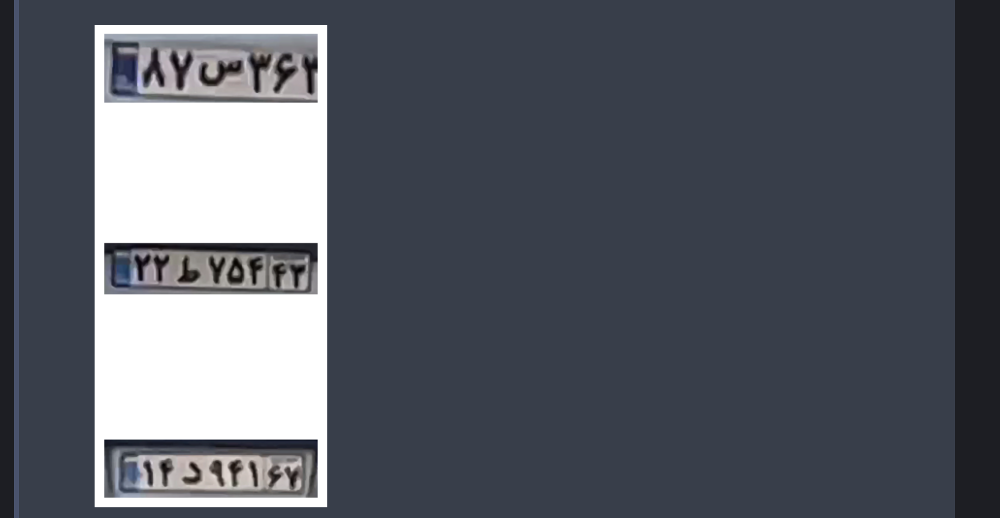
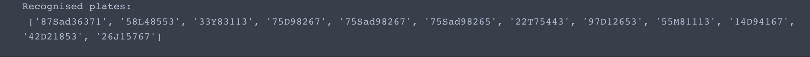

# LPR_EvaDB
## Car License Plate Recognition Using Yolov8 and EvaDB

### Please follow the instructions to run the program correctly:
  1. add the `yolo_object_detection.py` file to the [functions](https://github.com/georgia-tech-db/evadb/tree/master/evadb/functions) folder in EvaDB.
  2. Change the location to `best_LP.pt` file in [line 27](https://github.com/mohammadhosseinipour/LPR_EvaDB/blob/main/yolo_object_detection.py#L27) of `yolo_object_detection.py` to its address in your machine to run correctly.
  3. Keep the location to your functions folder in your machine to enter while running the program when requested.
  4. Make sure the links to your online videos or images are correct(e.g. not links to videos in preview mode).
  5. Be aware that the recognition of characters in this program is specifically trained for the Persian alphabet.
  6. While running the program, when you see three examples figure of the input frames, close it to enter the recognition phase.
     

NOTE: 
  1. The file `LPR_EvaDB.py` will do License Plate Recognition.
  2. The file `LPD_EvaDB.py` will do License Plate Detection only.
  3. The file `YOLOv8_train.ipynb` is used to train YOLOv8.
  4. The Dataset used for training Yolov8 is [HERE](https://universe.roboflow.com/university-of-padova-gfi4l/lpr-zlj3c).
  5. The `LPR_EvaDB.py` was created to process videos from the traffic cameras, so it highly depends on the angle of the video capture.

### Setup:
  Ensure that the local Python version is >= 3.11.5. To install the required libraries, run the following command on your terminal in the repository's root path(It is recommended to use a virtual environment!):
  
  ```bat
  pip install -r requirements.txt
  ```

### How to run?:
  1. When you run the program, you will see some of the instructions listed above.
  2. The first input would be the location of the functions folder of the evadb in your machine.
  3. Then you have to choose either between processing images or videos(write `img` or `vid`).
  4. Then you will be asked to pick how you want to provide the input, either online or locally(write `online` or `local`).
  5. Now provide the link to the online video(not in preview mode) or path to the local video(hit Enter to use the default path or [img-link](https://www.dropbox.com/scl/fi/1nls2y7neow6x42yra6ak/000005.png?rlkey=gwabhlhr3m6tgl1svgwcxt6xv&dl=1),[vid-link](https://www.dropbox.com/scl/fi/41zosrmwg1asbjfazsts8/test2.mp4?rlkey=r3dlhhmxs63b4x7drv02x4fj3&dl=1)).
  6. Again it jumps on step 4 till you load all your inputs.
  7. After you add all your links and paths, you can proceed to Plate Detection by writing `done`.
  8. You can now specify the number of frames you want to be processed(for whole data only hit Enter!).
  9. if you are running `LPD_EvaDB.py`, you will see the detected plates, and the program ends!
  10. If you are running `LPR_EvaDB.py`, you will see up to Three detected plates, by closing the shown figure, the program will enter the character recognition phase.
  11. At the end you will see a list of recognized plates.
### Result Examples:

  


👻: life is short, no time to waste:)
